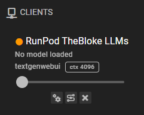

## RunPod integration

RunPod allows you to quickly set up and run text-generation-webui instances on powerful GPUs, remotely. If you want to run the significantly larger models (like 70B parameters) with reasonable speeds, this is probably the best way to do it.

### Create / grab your RunPod API key and add it to the talemate config

You can manage your RunPod api keys at [https://www.runpod.io/console/user/settings](https://www.runpod.io/console/user/settings)

Add the key to your Talemate config file (config.yaml):

```yaml
runpod:
    api_key: <your api key>
```

Then restart Talemate.

### Create a RunPod instance

#### Community Cloud

The community cloud pods are cheaper and there are generally more GPUs available. They do however not support persistent storage and you will have to download your model and data every time you deploy a pod.

#### Secure Cloud

The secure cloud pods are more expensive and there are generally fewer GPUs available, but they do support persistent storage.

Peristent volumes are super convenient, but optional for our purposes and are **not** free and you will have to pay for the storage you use.

### Deploy pod

For us it does not matter which cloud you choose. The only thing that matters is that it deploys a text-generation-webui instance, and you ensure that by choosing the right template.

Pick the GPU you want to use, for 70B models you want at least 48GB of VRAM and click `Deploy`, then select a template and deploy.

When choosing the template for your pod, choose the `RunPod TheBloke LLMs` template. This template is pre-configured with all the dependencies needed to run text-generation-webui. There are other text-generation-webui templates, but they are usually out of date and this one i found to be consistently good.

> :warning: The name of your pod is important and ensures that Talemate will be able to find it. Talemate will only be able to find pods that have the word `thebloke llms` or `textgen` in their name. (case insensitive)

Once your pod is and deployed has finished setup and is running, the client will automatically appear in the Talemate client list, making it available for you to use like you would use a locally hosted text-generation-webui instance.



### Connecting to the text-generation-webui UI

To manage your text-generation-webui instance, click the `Connect` button in your RunPod pod dashboard at [https://www.runpod.io/console/pods](https://www.runpod.io/console/pods) and in the popup click on `Connect to HTTP Service [Port 7860]` to open the text-generation-webui UI. Then just download and load your model as you normally would.

## :warning: Always check your pod status on the RunPod dashboard

Talemate is not a suitable or reliable way for you to determine whether your pod is currently running or not. **Always** check the runpod dashboard to see if your pod is running or not.

While your pod us running it will be eating up your credits, so make sure to stop it when you're not using it.
